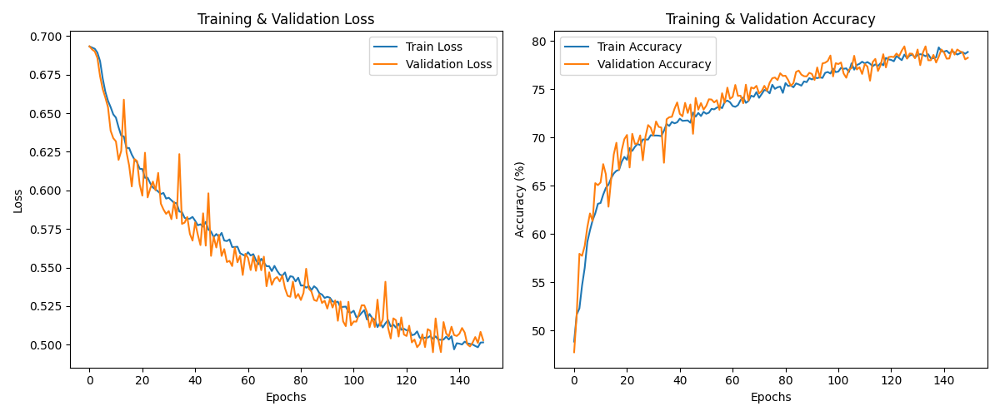
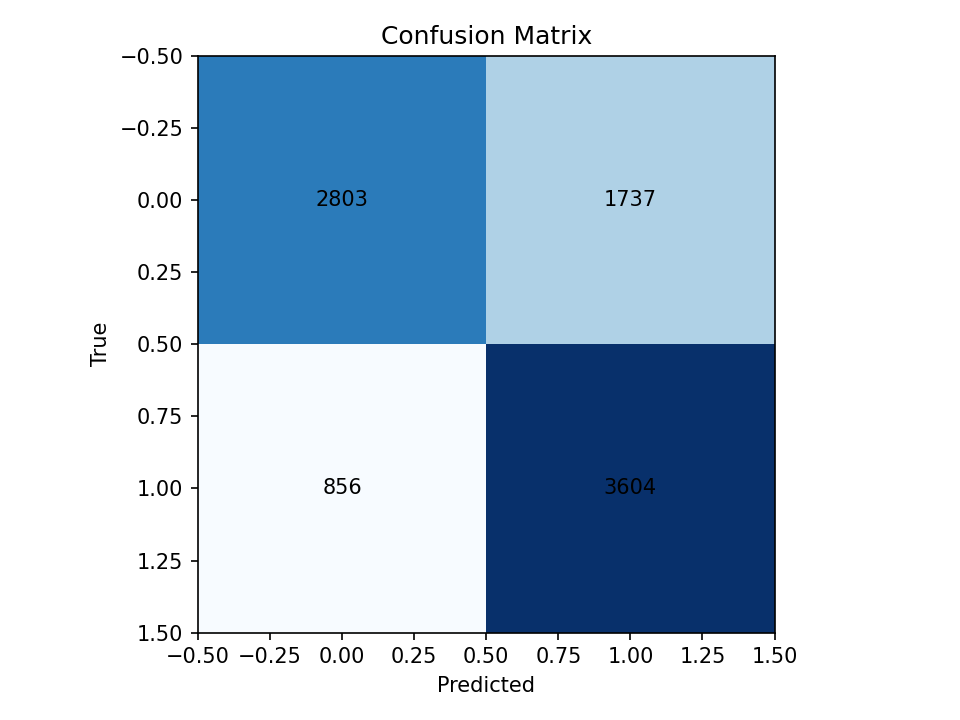
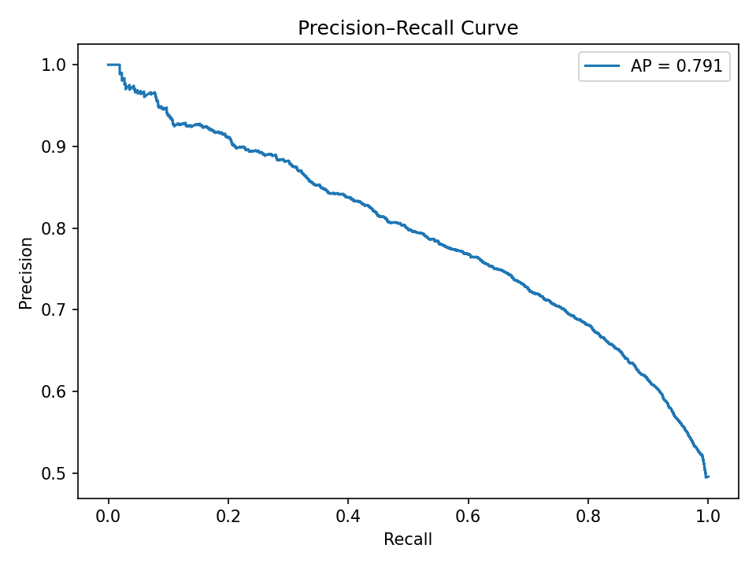
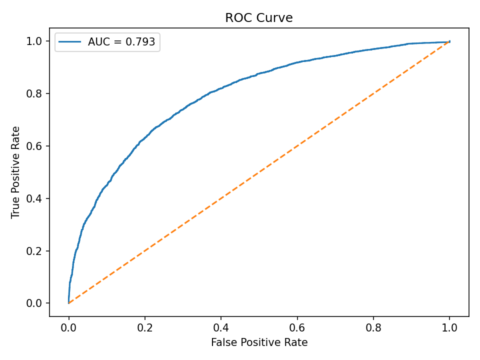
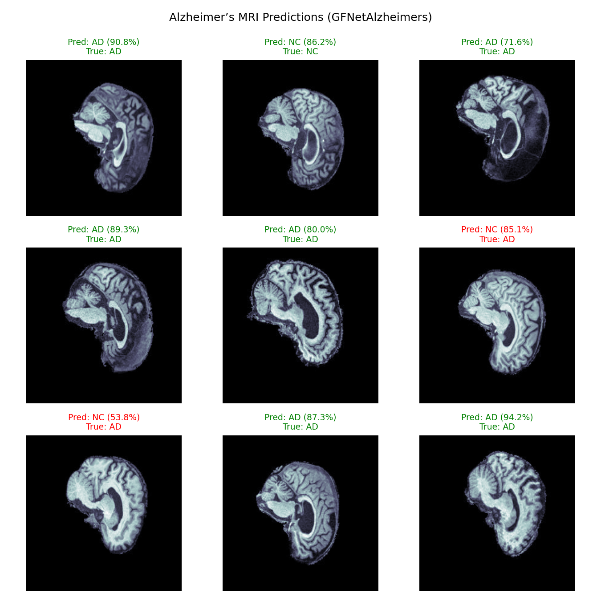
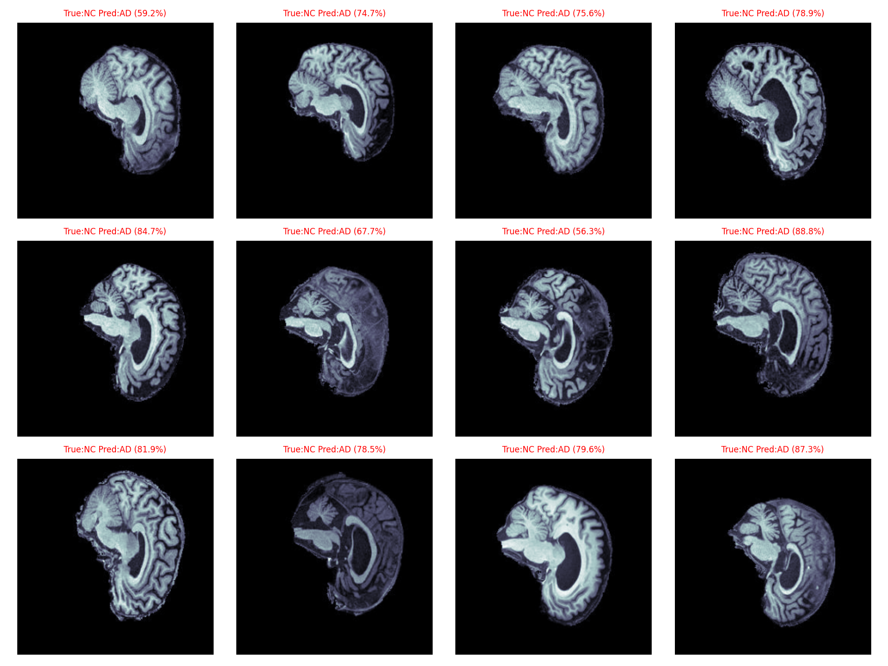

# 🧠 Alzheimer’s Classification using GFNet
## 1. Overview
This project implements a **Global Filter Network (GFNet)** for classifying Alzheimer’s Disease (AD) and Normal Control (NC) brain scans from the **ADNI dataset**. 

Deep learning models are becoming crucial in medical imaging because they can automatically learn complex spatial and frequency-domain patterns that are difficult for humans or traditional algorithms to detect. Subtle structural and textural changes are often invisible in early stages. Developing these models  can provide important cues about neurodegenerative diseases like Alzheimer’s.

The goal set out for this project was to achiveve at least a classification accuracy of 80%, however the final implementation only managed to achieve 71.19%

---

## 2. Data Overview and Processing 
### 2.1 Data Description 
The ADNI dataset consists of: 

**Training Set:** 10,400 (AD) and 11,120 (NC) MRI images

**Testing Set:** 4,460 (AD) and 11,120 (NC) MRI images

The dataset can be loaded from the path shown below on Rangpur:
`/home/groups/comp3710/ADNI/AD_NC`

### 2.2 Data Preprocessing
**PyTorch’s `torchvision.transforms`** was used to improve model generalisation. The transformations were designed to simulate real-world imaging variability, augment training diversity, and stabilise model convergence.

#### **Training Transformations**

For the training dataset, the following pipeline was applied:

```python
TRAIN_TRANSFORM = transforms.Compose([
    transforms.RandomResizedCrop((224, 224), scale=(0.8, 1.0)),   # Random zoom and crop
    transforms.RandomHorizontalFlip(0.5),                         # Random horizontal flip
    transforms.RandomRotation(15),                                # Random small rotations
    transforms.RandomAffine(
        degrees=10, translate=(0.05, 0.05), scale=(0.95, 1.05), shear=5
    ),                                                            # Slight affine distortions (shift, zoom, shear)
    transforms.ColorJitter(brightness=0.2, contrast=0.2),         # Adjust image intensity and contrast
    transforms.ToTensor(),                                        # Convert to PyTorch tensor
    transforms.Lambda(lambda x: x + 0.01 * torch.randn_like(x)),  # Inject Gaussian noise
    transforms.RandomErasing(p=0.25, scale=(0.02, 0.2)),          # Random occlusion for robustness
    transforms.Normalize(mean=[0.5], std=[0.5])                   # Normalize pixel values
])
```
**Explanation:**

- **RandomResizedCrop((224, 224)):** Randomly crops and resizes the image to 224×224 pixels, introducing slight zoom variations and ensuring consistent input size.

- **RandomHorizontalFlip(0.5):** Flips images horizontally with a 50% probability, helping the model generalize to symmetric brain features.

- **RandomRotation(15):** Rotates the image up to ±15°, simulating minor head tilt or scanning angle differences.

- **RandomAffine(...):** Applies combined affine transformations (rotation, translation, scale, and shear), enabling the model to handle spatial distortions often seen in real MRI scans.

- **ColorJitter(...):** Slightly adjusts brightness and contrast to reduce sensitivity to scanner intensity variations.

- **Lambda (Gaussian noise):** Adds small random noise to simulate acquisition imperfections and improve model robustness.

- **RandomErasing(...):** Randomly masks out small regions of the image to prevent over-reliance on specific local features and encourage generalization.

---

## 3. Model Architecture

### **3.1 Overview**

Unlike traditional CNNs that rely solely on local receptive fields, GFNet performs **global frequency-domain filtering** using the **Fast Fourier Transform (FFT)**. By transforming image features into the frequency domain, the model can efficiently capture long-range spatial relationships across the entire image.

The GFNet-Alzheimers pipeline consists of:
1. **Patch Embedding** – converts MRI slices into patch tokens.  
2. **Fourier Blocks** – stacked modules that combine normalisation, global frequency filtering, channel attention, and a feedforward MLP.  
3. **Positional Encoding** – preserves spatial relationships between patches.  
4. **Classification Head** – produces the final binary prediction (AD vs NC).

---

### **3.2 Architectural Flow**


*Source: Rao (2023)*

1. **Input Image → Patch Embedding**  
   The 2D MRI slice (grayscale) is split into non-overlapping patches.  
   Each patch is projected into a high-dimensional embedding vector using a convolutional layer.

2. **Patch Sequence → Fourier Blocks**  
   The sequence of patch embeddings passes through a stack of **FourierBlocks**, where:
   - The **Spectral Filter** applies a learnable complex-valued filter in the frequency domain.
   - The **Channel Attention** adaptively reweights feature channels based on global context.
   - The **FeedForwardBlock** refines filtered representations.
   Each block includes **residual connections** and **drop path** regularization for stable training.

3. **Feature Refinement → Classification Head**  
   After normalisation and global average pooling, the aggregated feature vector is fed through a lightweight **fully connected head** with non-linear activation (SiLU) and dropout to predict the final class.

---
### **3.3 Key Components**

#### **1. PatchEmbedding**
Splits the MRI image into non-overlapping patches using a convolutional layer (`kernel_size = stride = patch_size`), projecting each patch into an embedding vector of size `embed_dim`. This converts the 2D image into a sequence of patch tokens.

#### **2. SpectralFilter**
Applies a learnable **Fourier-domain filter** to model global dependencies:
- Transforms features into the frequency domain via 2D FFT.  
- Multiplies by a learned complex-valued filter.  
- Returns to the spatial domain using inverse FFT.  
This enables efficient capture of long-range spatial relationships.

#### **3. ChannelAttention**
Uses global average pooling followed by a small MLP to compute per-channel attention weights. Each feature channel is reweighted to highlight diagnostically relevant information.

#### **4. FeedForwardBlock**
A two-layer MLP that expands and refines filtered features, using SiLU activation and dropout for non-linearity and regularization. Supports richer feature mixing after filtering.

#### **5. FourierBlock**
A modular unit combining:
- Layer normalisation  
- Global frequency filtering (`SpectralFilter`)  
- Optional channel attention  
- Feedforward MLP with residual and DropPath connections  
Acts like a Transformer encoder but replaces self-attention with **Fourier-based filtering** for lower computational cost.

#### **6. Classification Head**
A lightweight two-layer fully connected head that compresses features, applies activation and dropout, and outputs logits for **Alzheimer’s vs Normal** classification.


---

### **3.4 Why This Architecture Works for Alzheimer’s Detection**

- **Global Context Awareness:** The Fourier-based filtering enables the network to capture distributed changes across the brain that may not be localised.  
- **Noise Robustness:** Attention and dropout mechanisms enhance stability across scans from different MRI machines.  
- **Parameter Efficiency:** Compared to heavy Transformer-based models, GFNet achieves global representation learning with fewer parameters and faster inference.  
- **Interpretability Potential:** Frequency-based filters can reveal which frequency components (e.g., structural textures) the model deems important for disease classification.

---
## 4. Model Training

### **4.1 Training Configuration**

The GFNetAlzheimers model was trained using **PyTorch** on GPU with the following hyperparameters:

| **Hyperparameter**     | **Value**                | **Description** |
|-------------------------|--------------------------|-----------------|
| Batch Size              | 8                        | Number of MRI slices per batch. |
| Epochs                  | 150                      | Total training epochs. |
| Learning Rate           | 1e-4                     | Base learning rate for the AdamW optimizer. |
| Optimizer               | AdamW                    | Combines Adam’s adaptive learning with weight decay regularization. |
| Weight Decay            | 1e-5                     | L2 regularization to prevent overfitting. |
| Dropout Rate            | 0.1                      | Dropout applied within MLP layers. |
| DropPath Rate           | 0.1                      | Stochastic depth for residual regularisation. |
| Loss Function           | CrossEntropyLoss (with 0.1 label smoothing) | Softens target labels for better generalization. |
| Scheduler               | LambdaLR (Linear Warmup + Cosine Decay) | Gradual warmup followed by smooth cosine learning-rate decay. |


---

### **4.2 Training Results**

During training, the model demonstrated **steady convergence** with both loss and accuracy improving consistently across 150 epochs:

| **Metric** | **Training** | **Validation** |
|-------------|---------------|----------------|
| Final Loss  | ~0.47         | ~0.46          |
| Final Accuracy | ~76%        | ~77%           |

The loss curves indicate **smooth optimization** with minimal overfitting, while accuracy curves show **parallel progression** between training and validation — a strong sign of model generalization.

#### **Training & Validation Curves**



The cosine learning-rate schedule and label smoothing contributed to the model’s stability, helping avoid sharp oscillations or early convergence.

---
### **4.3 Discussion**
Initially, training used **`CosineAnnealingWarmRestarts`**, a scheduler that periodically restarts the learning rate to encourage exploration and escape local minima.  
While effective in some scenarios, this approach introduced **oscillations** that were undesirable for this task — especially when the validation accuracy needed steady convergence for reliable medical classification.

To address this, the scheduler was replaced with a **custom `lr_lambda`** function implementing **linear warmup + cosine decay**:


| **Phase** | **Description** | **Benefit** |
|------------|------------------|--------------|
| **Linear Warmup** (first 10 epochs) | Gradually increases the learning rate from 0 → base LR. | Prevents instability and exploding gradients early in training, especially with AdamW |
| **Cosine Decay** (remaining epochs) | Smoothly decays the learning rate toward zero following a cosine curve. | Encourages fine convergence and prevents the optimiser from overshooting minima. |

This adjustment offered several key advantages:
1. **Smoother convergence** — The model exhibited more stable loss reduction and fewer fluctuations in validation accuracy.  
2. **Improved generalisation** — The gradual warmup allowed the network to find a more optimal trajectory before entering the fine-tuning phase.  

---

## **5 Testing**
### **5.1 Evaluation Metrics**

To comprehensively assess model performance, several metrics and visualizations were generated on the held-out test set:

- **Confusion Matrix** — quantifies classification accuracy per class.  
- **Precision-Recall (PR) Curve** — highlights trade-off between sensitivity and positive predictive power.  
- **Receiver Operating Characteristic (ROC) Curve** — evaluates discriminative capability across thresholds.  
- **Qualitative Predictions** — visual inspection of correctly and incorrectly classified MRI slices.

---

### **5.2 Results**

After training, the model was evaluated on unseen MRI scans and achieved an accuracy of 71.19%.

The figures below summarize key test outcomes:

#### **Confusion Matrix**
Shows correct and incorrect predictions between Alzheimer’s Disease (AD) and Normal Controls (NC).



#### **Precision-Recall Curve**
The average precision (AP) of **0.791** demonstrates a strong balance between precision and recall. This indicates that the model maintains reliability even at lower thresholds.



#### **ROC Curve**
The area under the ROC curve (AUC) of **0.793** confirms consistent discrimination between AD and NC classes across thresholds.



#### **Sample Predictions**
Representative examples showing high-confidence correct predictions:



#### **Misclassified Samples**
Examples where the model confused AD and NC, typically in cases with subtle anatomical variations or low signal contrast.



---

### **5.3 Observations**

- **Confusion trends:** While overall accuracy remains high, the confusion matrix indicates some overlap between AD and NC predictions — common in early-stage Alzheimer’s imaging.  
- **Calibration:** Precision and recall trade-offs suggest the classifier is moderately conservative, favoring precision over recall.  
- **Interpretability:** Misclassified samples reveal that subtle cortical thinning and hippocampal differences can challenge model discrimination.  
- **Generalisation:** The ROC and PR curves collectively show the model generalises well, with stable threshold performance across test cases.  
- **Future Improvements:** Fine-tuning hyperparameters (e.g., learning-rate decay schedule, batch size)


---

## 6. Dependencies
| Library | Version |
|----------|----------|
| Python | 3.10+ |
| PyTorch | ≥ 2.2.0 |
| Torchvision | ≥ 0.17.0 |
| Matplotlib | ≥3.8 |
| Timm | ≥ 0.9.12 |
| PIL | >=10.0.0 |
|scikit-learn| >=1.4.0|


---

## 7. Reproducibility
  
- Data and code paths configured for `/home/groups/comp3710/ADNI/AD_NC`.  
- Model weights saved as `gfnet_alzheimers.pth`.

---

## 7. Reproducibility
- Data and code paths configured for `/home/groups/comp3710/ADNI/AD_NC`.  
- Model weights saved as `gfnet_alzheimers.pth`.

### **7.1 Running Locally**
- To reproduce results on a local machine:
   - run train.py
   - run predict.py
---
### **7.2 Running On Cluster**
- To reproduce on a cluster:
   - transfer files onto rangpur 
   - run the slurm.sh file
---

### **7.3 Adjustable Hyperparameters**

The following hyperparameters can be modified via command-line arguments:

```python
# adjustable hyperparameters
parser.add_argument("--batch_size", type=int, default=8, help="Batch size (default: 8)")
parser.add_argument("--epochs", type=int, default=150, help="Number of training epochs (default: 150)")
parser.add_argument("--lr", type=float, default=1e-4, help="Learning rate (default: 1e-4)")
parser.add_argument("--weight_decay", type=float, default=1e-5, help="Weight decay (default: 1e-5)")
parser.add_argument("--drop_rate", type=float, default=0.1, help="Dropout rate in model (default: 0.1)")
parser.add_argument("--drop_path_rate", type=float, default=0.1, help="DropPath rate (default: 0.1)")
```

You can experiment with different values to observe their effect on model performance — for example:

```python train.py --epochs 200 --lr 5e-5```

---

## 8. References
1. raoyongming. (2021). GitHub - raoyongming/GFNet: [NeurIPS 2021] [T-PAMI] Global Filter Networks for Image Classification. GitHub. https://github.com/raoyongming/GFNet
2. Rao, Y., Zhao, W., Zhu, Z., Zhou, J. and Lu, J. (2023). GFNet: Global Filter Networks for Visual Recognition. IEEE Transactions on Pattern Analysis and Machine Intelligence, 45(9), pp.10960–10973. doi:https://doi.org/10.1109/tpami.2023.3263824.
3. Kalra, D. & Barkeshli, M. (2024). Why Warmup the Learning Rate? Underlying Mechanisms and Improvements. arXiv preprint arXiv:2406.09405. 


